[github](https://github.com/manvesh12) &nbsp;·&nbsp;
[repositories](https://github.com/manvesh12?tab=repositories) &nbsp;·&nbsp;
[start a conversation](https://github.com/manvesh12/manvesh12/issues/new?title=Let%27s%20build%20something)

> B.Tech CSE · Chandigarh University · Class of 2027 
> Full-stack builder based in Chandigarh, India 🇮🇳

I turn complicated workflows into focused, dependable products — from polished 
interfaces to APIs, databases, authentication, document automation, and deployment. 
Right now I am building public-sector workflow tools and AI-assisted learning products.

<samp>typescript &nbsp; javascript &nbsp; java &nbsp; react &nbsp; next.js &nbsp; node.js &nbsp; express &nbsp; postgres &nbsp; supabase &nbsp; mongodb &nbsp; redis &nbsp; aws &nbsp; git</samp>

**[Punjab District Survey Report Portal](https://github.com/manvesh12/dsrpunjab-main-bymanvesh)** &nbsp;·&nbsp; <samp>next.js, typescript, postgres</samp> 
A multi-role government workflow for reports, annexures, document uploads, 
review dashboards, and PDF compilation.

**[CampusGPT · StudySaathi](https://github.com/manvesh12/campusGPT)** &nbsp;·&nbsp; <samp>next.js, openai, supabase</samp> 
An AI study companion for grounded document chat, summaries, exam questions, 
MCQs, and flashcards.

**[Student Management System](https://github.com/manvesh12/student-management-system)** &nbsp;·&nbsp; <samp>node.js, express, mongodb</samp> 
A full-stack CRUD application with REST endpoints and persistent student records.

**[ID Card Generator](https://github.com/manvesh12/id-card-generator)** &nbsp;·&nbsp; <samp>javascript, html, css</samp> 
A focused browser utility for producing structured digital ID cards.

Every graphic on this page belongs to this repository. The portrait is generated 
from my profile photo by [`scripts/generate_portrait.py`](scripts/generate_portrait.py); 
the contribution, streak, language, and year graphics are drawn by 
[`scripts/update_profile.py`](scripts/update_profile.py) from GitHub's GraphQL API.

A [scheduled action](.github/workflows/refresh-profile.yml) refreshes the data once 
a day and commits only when pixels actually change. There are no hosted stat cards, 
tracking counters, or third-party image services to rate-limit or disappear.

The reveal animation lives inside each SVG using SMIL because GitHub strips scripts 
from profile READMEs. Portrait rows use explicit text lengths, so the character grid 
keeps its shape across operating systems without loading an external font.

