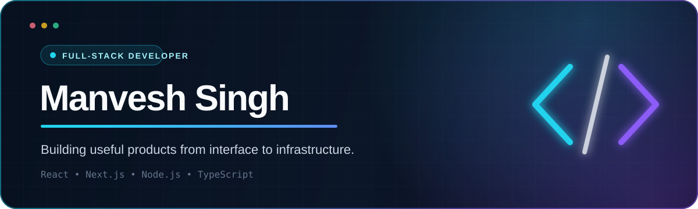

<div align="center">



<br />

[](https://github.com/manvesh12?tab=repositories)
[](https://github.com/manvesh12)
[](https://github.com/manvesh12?tab=followers)

<p>
  <strong>B.Tech CSE · Chandigarh University · Class of 2027</strong><br />
  <sub>Based in Chandigarh, India 🇮🇳</sub>
</p>

</div>

## About me

I am a full-stack developer who enjoys turning complex workflows into simple, reliable digital products. I work across polished user interfaces, APIs, databases, authentication, document automation, and deployment—with a strong focus on practical impact.

```ts
const manvesh = {
  focus: ["Full-stack engineering", "Product development", "Workflow automation"],
  currentlyBuilding: "Punjab District Survey Report Portal",
  learning: ["Scalable backend systems", "Cloud architecture", "AI-powered products"],
  openTo: ["Internships", "Collaborations", "Interesting engineering problems"]
};
```

## What I work with

<div align="center">

| Frontend | Backend | Data & Infrastructure |
|:---:|:---:|:---:|
|  |  |  |

</div>

## Featured work

<table>
  <tr>
    <td width="58%" valign="top">
      <h3>Punjab District Survey Report Portal</h3>
      <p>A full-stack government workflow platform for managing district survey reports, multi-role reviews, annexures, document uploads, dashboards, and PDF compilation.</p>
      <p><strong>Stack:</strong> Next.js · React · TypeScript · Node.js · Express · PostgreSQL · Prisma · Redis · AWS S3</p>
      <p>
        <a href="https://github.com/manvesh12/punjab_dsr"></a>
        <a href="https://punjab-dsr.vercel.app"></a>
      </p>
    </td>
    <td width="42%" valign="top">
      <h3>CampusGPT · StudySaathi</h3>
      <p>An AI study companion that turns uploaded PDF notes into grounded chat, summaries, exam questions, MCQs, and flashcards.</p>
      <p><strong>Stack:</strong> Next.js · TypeScript · OpenAI · Supabase</p>
      <p>
        <a href="https://github.com/manvesh12/campusGPT"></a>
      </p>
    </td>
  </tr>
  <tr>
    <td width="58%" valign="top">
      <h3>Student Management System</h3>
      <p>A full-stack CRUD application for managing student records through a REST API with persistent database storage.</p>
      <p><strong>Stack:</strong> JavaScript · Node.js · Express · MongoDB</p>
      <p>
        <a href="https://github.com/manvesh12/student-management-system"></a>
      </p>
    </td>
    <td width="42%" valign="top">
      <h3>ID Card Generator</h3>
      <p>A focused web utility for creating digital ID cards through a simple, accessible browser interface.</p>
      <p><strong>Stack:</strong> JavaScript · HTML · CSS</p>
      <p>
        <a href="https://github.com/manvesh12/id-card-generator"></a>
        <a href="https://id-card-generator-henna.vercel.app"></a>
      </p>
    </td>
  </tr>
</table>

## GitHub snapshot

<div align="center">


</div>

## Let’s build something useful

I am interested in full-stack internships, collaborative product work, and projects that solve real operational problems. The best way to reach me is through GitHub.

<div align="center">

[](https://github.com/manvesh12)
[](https://github.com/manvesh12?tab=repositories)

<br /><br />

<sub>Designed with clarity, built with curiosity.</sub>

</div>
